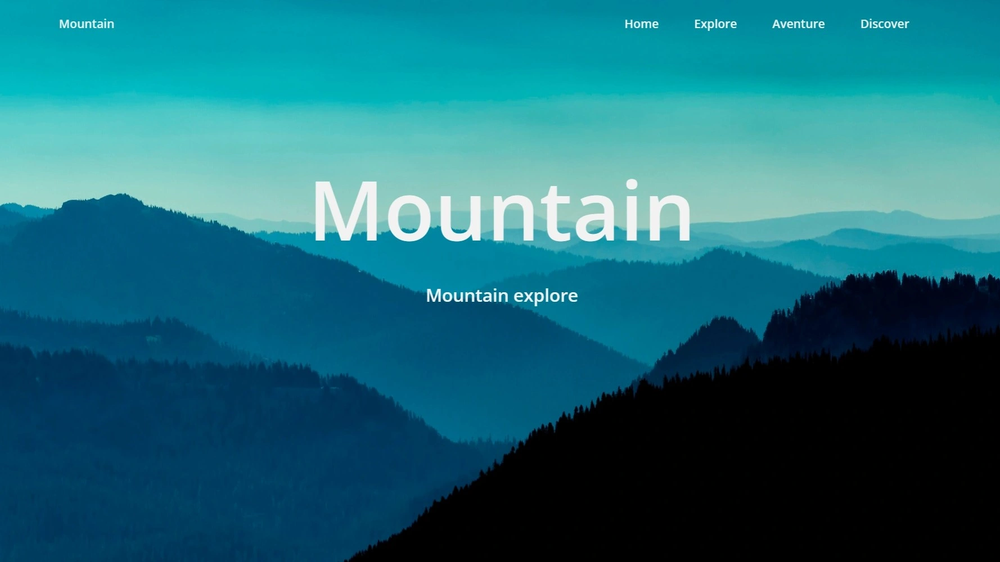

<div align="center">
    <a href="https://parallax-3-fv.netlify.app"" target="_blank">
      
    </a>
  <h3 align="center">Parallax - Mountain #3</h3>
</div>


##  <br /> 📋 <a name="table">Table of Contents</a>

- ✨ [Introduction](#introduction)
- ⚙️ [Tech Stack](#tech-stack)
- 🚀 [Quick Start](#quick-start)

##  <br /> <a name="introduction">✨ Introduction</a>

**[EN]** Parallax landing page design featuring a modern and minimalist aesthetic, crafted using HTML, CSS, and JavaScript. This project is a test to build a parallax effect while scrolling the page.

**[FR]** Conception de page d'accueil Parallax avec un design moderne et minimaliste, réalisée en HTML, CSS et JavaScript. Ce projet est un test pour créer un effet de parallaxe lors du défilement de la page.

##  <br /> <a name="tech-stack">⚙️ Tech Stack</a>

- HTML
- CSS
- JavaScript

## <br /> <a name="quick-start">🚀 Quick Start</a>

Follow these steps to set up the project locally on your machine.

<br/>**Prerequisites**

Make sure you have the following installed on your machine:

- [Git](https://git-scm.com/)
- [Node.js](https://nodejs.org/en)
- [npm](https://www.npmjs.com/) (Node Package Manager)

<br/>**Cloning the Repository**

```bash
git clone {git remote URL}
```

<br/>**Running the Project**

Use [Live Server](https://marketplace.visualstudio.com/items?itemName=ritwickdey.LiveServer)
to launch a development local server with live reload feature for static & dynamic pages.